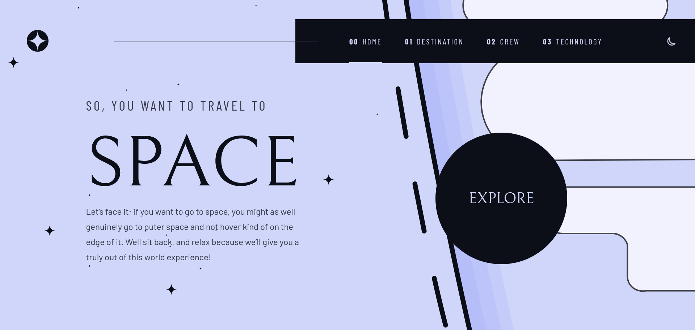
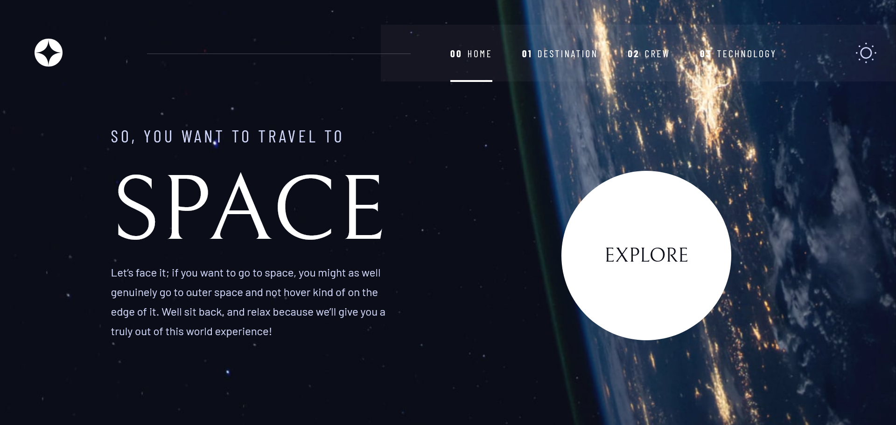

# Frontend Mentor - Space tourism website solution

This is a solution to the [Space tourism website challenge on Frontend Mentor](https://www.frontendmentor.io/challenges/space-tourism-multipage-website-gRWj1URZ3). Frontend Mentor challenges help you improve your coding skills by building realistic projects.

## Table of contents

- [Overview](#overview)
  - [The challenge](#the-challenge)
  - [Screenshots](#screenshots)
  - [Links](#links)
- [My process](#my-process)
  - [Built with](#built-with)
  - [What I learned](#what-i-learned)
  - [Small additions](#small-additions)
  - [Useful resources](#useful-resources)
- [Author](#author)
- [Acknowledgments](#acknowledgments)

## Overview

### The challenge

Users should be able to:

- View the optimal layout for each of the website's pages depending on their device's screen size
- See hover states for all interactive elements on the page
- View each page and be able to toggle between the tabs to see new information
- Toggle between light and dark themes

### Screenshots

### Links

- Solution URL: [Add solution URL here](https://your-solution-url.com)
- Live Site URL: [Live Demo](https://space-tourism-website-one-steel.vercel.app/)

## My process

### Built with

- Semantic HTML5 markup
- CSS custom properties
- Flexbox
- CSS Grid
- Mobile-first workflow
- [React](https://reactjs.org/)
- [Framer Motion](https://www.framer.com/motion/) - Used it for adding transitions between routes

### What I learned

While following along Kevin Powell's tutorial on scrimba, I learned how to use the Mobile-first workflow to add styles in css. Then I discovered an animation library called Framer Motion while searching for an easy way to add transition animations between routes.

I stumbled across a problem while adding an overlay over the background image that hides it when changing routes, where the overlay would be smaller (in height) than the background image on certain pages like the crew or technology pages. The overlay I used is a pseudo-element of the app div that I gave a `position: absolute` and `inset: 0`, the problem lays in the `inset: 0` where that gives the overlay the height and width of the viewport but sometimes the page has a height greater than the viewport (scrollable page). To solve that problem, I changed the inset property to `inset: 0 0 auto 0` and gave it a `height: var(--height)` where `--height` has a value of `100vh` set initially. Then using javascript, I changed the height of the overlay using the `--height` custom css property (I created a state variable for the height in the app component). A similar problem then appeared while changing tabs in the same page (the crew page for example) where the overlay is smaller than the height of the actual page, to solve that a gave the `setHeight` function (that updates the height of the overlay) as a prop to all other pages and then updated the height when changing tabs.

Another problem I faced was that when switching tabs in the destination, crew, or technology pages, the asset of the old tab stays visible till the new asset loads. I fixed that by making svg placeholders for all the assets that change when switching tabs, then the placeholder is replaced by the appropriate asset when it is loaded.

### Small additions

- A light theme (not as good as the dark one) where I recreated all the assets to match the light colors properly.
- A small animation when clicking the burger menu icon (inspired by a codepen linked below in the [Useful resources](#useful-resources) section).
- A click animation for the theme toggler which is similar to the burger menu icon animation.
- Transition animations between routes using the Framer Motion animation library.
- An overlay to hide the background image when switching between routes.
- Placeholders for all the assets in the destination, crew, and technology pages that disappear when the assets are loaded.
- Added arrow controls to switch between tabs in the crew page on mobile and tablet, since switching tabs using the dot indicators is frustrating on mobile devices.

### Useful resources

- [An article about progressive image loading](https://blog.logrocket.com/progressive-image-loading-react-tutorial/) - This article helped me a bit on how check if the image is loaded.
- [Framer Motion Docs](https://www.framer.com/motion/) - This helped me learn how to use Framer Motion for my specific needs (adding transitions between routes).
- [A codepen by Vikram](https://codepen.io/vikramcodes/pen/mdVxNby) - This codepen inspired me to create my own menu and theme toggler icons that can be animated similar to that codepen.

## Author

- Frontend Mentor - [@Salah1221](https://www.frontendmentor.io/profile/Salah1221)

## Acknowledgments

I want to give credit to Kevin Powell whose [excellent tutorial](https://scrimba.com/learn/spacetravel) on scrimba helped me alot especially the grid container that helped me create the layouts easily.
